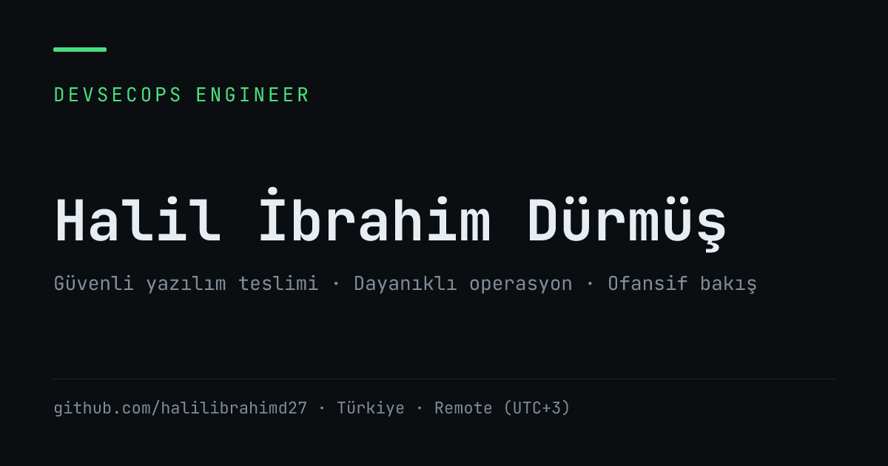

<div align="center">



### [halilibrahimd27.github.io](https://halilibrahimd27.github.io/)

**[Türkçe](https://halilibrahimd27.github.io/)** · **[English](https://halilibrahimd27.github.io/en/)** · **[Kullandıklarım](https://halilibrahimd27.github.io/uses)**

[](https://github.com/halilibrahimd27/halilibrahimd27.github.io/actions/workflows/ci.yml)
[](https://github.com/halilibrahimd27/halilibrahimd27.github.io/actions/workflows/deploy.yml)

</div>

---

Kişisel tanıtım sitem. İki dilli, tamamen statik, GitHub Pages'te yayında.

Bir portfolyo sitesinin kendisi de bir teslim işidir: tarayıcıya ne kadar JavaScript gönderdiğiniz,
hangi güvenlik politikasıyla gittiğiniz ve bir şey bozulduğunda bunu kimin fark ettiği ölçülebilir
şeylerdir. Bu repo o ölçülerle yazıldı.

## Rakamlar

Hepsi bu repodaki build'den ölçüldü — hedef değil, çıktı.

|                    |                                                      |
| ------------------ | ---------------------------------------------------- |
| Client JavaScript  | **4.9 KB** ham · ~2.6 KB gzip                        |
| UI framework       | **yok** — React/Preact/Svelte hiçbiri kurulu değil   |
| Üçüncü parti istek | **0** — analytics, tracker, CDN, çerez yok           |
| CSS                | 24.8 KB ham · 6.0 KB gzip                            |
| Font               | 4 dosya, yalnızca `latin` + `latin-ext`, self-hosted |
| Toplam çıktı       | 471 KB / 5 sayfa                                     |
| CSP                | `'unsafe-inline'` **içermiyor**                      |
| JS kapalıyken      | 7/7 bölüm, 12 proje kartı, 10.694 karakter okunur    |

## Öne çıkan kararlar

**Sıfır framework, dört küçük island.** Tema değiştirici, dil değiştirici, GitHub yıldız verisi ve
scroll-spy/reveal — hepsi vanilla TypeScript, toplamı 4.9 KB. Astro'nun varsayılan zero-JS davranışı
korundu: bir bileşen JavaScript gerektirmiyorsa göndermiyor.

**JavaScript kapalıyken site eksiksiz okunur.** Bölümler, projeler, deneyim, iletişim — hepsi
sunucuda render edilmiş halde. Kaybolan tek şey tema butonu, canlı yıldız sayıları ve aktif bölüm
vurgusu. Scroll-reveal animasyonları içeriği gizleyerek değil, yalnızca JS _varsa_ devreye girerek
çalışır; JS yoksa hiçbir şey saklanmaz.

**`'unsafe-inline'` olmayan CSP.** GitHub Pages HTTP header veremediği için politika `<meta>` ile
kuruluyor. Inline `<style>` üretilmesin diye `build.inlineStylesheets: 'never'`; geriye kalan tek
inline blok olan JSON-LD'nin sha256'sı build sonunda bir Astro entegrasyonu tarafından politikaya
yazılıyor. Scroll-reveal gecikmeleri bile inline `style` attribute'u yerine veri attribute'u ve CSS
kuralıyla veriliyor — çünkü `style-src 'self'` inline style attribute'larını da bloklar ve hash'ler
onlara uygulanmaz.

> `<meta>` ile kurulan CSP'de `frame-ancestors`, `sandbox` ve `report-uri` tarayıcı tarafından yok
> sayılır. GitHub Pages header veremediği için bu üçü burada uygulanamıyor; politikaya varmış gibi
> eklenmedi.

**İki dil tip sistemiyle bağlı.** Sitedeki hiçbir metin bileşenlerin içine gömülü değil; hepsi
`src/data/content.tr.ts` ve `content.en.ts` içinde. İkisi de `src/data/types.ts`'teki `Content`
sözleşmesini `satisfies` ile karşılar. Bir alanı birine ekleyip diğerine eklemeyi unutmak **build'i
kırar** — iki dilin içeriği sessizce ayrışamaz.

**Kendi kendini denetleyen build.** `scripts/verify-build.mjs` her koşuda üretilen HTML'i tarar:
`target="_blank"` olan her link `rel="noopener noreferrer"` taşıyor mu, CSP hash'leri doldurulmuş
mu, politikaya `unsafe-*` sızmış mı, sayfaya doldurulmamış bir içerik yer tutucusu basılmış mı.
Sonuncusu boşuna eklenmedi: `/uses` sayfasındaki donanım satırları bir kez gerçekten yayına çıktı.
Artık build kırılıyor.

**WCAG AA, renkle sınırlı kalmadan.** Accent yeşili (`#4ADE80`) beyaz üstünde 1.7:1 — açık temada
metin olarak kullanılamaz. Bu yüzden iki ayrı token var: `--color-accent` dekoratif öğeler için,
`--color-accent-fg` metin için (açık temada `#15803D`, ≈5.0:1). Tek `<h1>`, landmark'lar, skip-link,
görünür focus ring, `prefers-reduced-motion` desteği.

**Tema sistemi canlı izler.** Kullanıcı bir tercih kaydetmediği sürece `data-theme` attribute'u hiç
yazılmaz ve site işletim sistemi temasını takip etmeye devam eder — sayfa yenilemeye gerek yok.
Toggle'a basıldığında seçim `localStorage`'a yazılır ve artık o kazanır.

**Pinlenmiş tedarik zinciri.** Her GitHub Action commit SHA'sına pinli (tag taşınabilir, SHA
taşınmaz). Deploy izinleri minimumda: `contents: read`, `pages: write`, `id-token: write`. OG görseli
üretimi ve tarayıcı denetimi kalıcı bağımlılık değil — gerektiğinde geçici kurulur, CI her koşuda
native binary indirmez.

## Nasıl doğrulandı

Ölçülen, varsayılan değil:

- `astro check` — 46 dosya, 0 hata
- Tarayıcı konsolu — 5 sayfada 0 error, 0 warning, 0 başarısız istek
- JavaScript kapalı — 7/7 bölüm görünür, 12 proje kartı render edilmiş
- Yatay taşma — 360 / 768 / 1440 px'te üç sayfada da yok
- Dış linkler, CSP ve içerik yer tutucuları — her build'de otomatik

`pnpm check:browser` bu denetimlerin tarayıcı tarafını tekrar çalıştırır.

## Mimari

```
src/
├─ data/           # sitedeki TÜM metin + tip sözleşmesi
│  ├─ types.ts        Content arayüzü — iki dili birbirine bağlar
│  ├─ content.tr.ts   Türkçe içerik
│  ├─ content.en.ts   İngilizce içerik
│  ├─ projects.ts     dilden bağımsız proje gerçekleri
│  ├─ timeline.ts     iş / eğitim / gönüllülük tarihleri
│  ├─ skills.ts       yetenek kategorileri
│  └─ site.ts         kimlik, linkler, CV algılama
├─ i18n/           # rota ve tarih yardımcıları (BASE_URL üzerinden)
├─ layouts/        # Base.astro — head, iskelet, island'lar
├─ components/     # head · nav · controls · sections · ui
├─ scripts/        # client island'ları (vanilla TS)
├─ styles/         # global.css (token'lar) · fonts.css
├─ assets/fonts/   # self-hosted woff2 alt kümeleri
└─ pages/          # / · /uses · /en/ · /en/uses · /404 · /robots.txt

integrations/csp.ts        inline script → sha256 → CSP meta
scripts/verify-build.mjs   build çıktısı denetimi (CI'da koşar)
scripts/browser-audit.mjs  konsol + JS-kapalı denetimi
scripts/og.ts              OG görseli üretimi
```

Metin ile gerçekler bilinçli olarak ayrı: proje _açıklaması_ dile bağlı olduğu için content
dosyalarında, proje _repo adı ve teknolojileri_ dilden bağımsız olduğu için `projects.ts`'te. Aynı
`id` ikisini birbirine bağlar ve TypeScript eşleşmeyi zorunlu kılar.

## Geliştirme

Node 22 ve pnpm gerekir.

```bash
pnpm install
pnpm dev              # http://localhost:4321
pnpm build            # → dist/
pnpm preview          # dist/'i yerelde sun
```

Kalite kapıları — CI'da da aynıları koşar:

```bash
pnpm typecheck        # astro check, iki dilin sözleşmesi dahil
pnpm lint             # eslint
pnpm format:check     # prettier
pnpm verify           # dist: rel, CSP ve içerik denetimi
pnpm linkcheck        # dist: kırık iç link taraması
```

### İçerik güncelleme

Yeni proje eklemek iki adım:

```ts
// 1) src/data/projects.ts
{
  id: 'repo-adi',                    // GitHub repo adı = kart başlığı
  repo: 'halilibrahimd27/repo-adi',
  tech: ['Python', 'Docker'],
  tier: 'featured',                  // featured · more · hidden
  homepage: 'https://...',           // opsiyonel, "Canlı" linki
  stars: 0,                          // GitHub'a ulaşılamazsa yedek değer
  updated: '2026-09-22',
}

// 2) content.tr.ts ve content.en.ts → projects.items altına aynı id ile tagline
```

Birini unutursanız build kırılır. `tier` kartın nasıl göründüğünü belirler: `featured` büyük kart,
`more` kompakt satır, `hidden` hiç render edilmez — veride durur, istendiğinde tek kelimeyle yayına
girer.

Yıldız sayıları ve son güncelleme tarihleri sayfa açıldığında GitHub REST API'sinden çekilir
(auth'suz, tek istek, 1 saatlik `localStorage` cache). Kartlar zaten statik veriyle tam render
edilmiştir; script yalnızca metni yerinde günceller. İstek başarısız olursa hiçbir şey olmaz — hata
gösterilmez, düzen kaymaz.

### Yapılandırma

| Ayar               | Yer                                 | Davranış                                                                                                     |
| ------------------ | ----------------------------------- | ------------------------------------------------------------------------------------------------------------ |
| İletişim e-postası | `src/data/site.ts` → `EMAIL`        | Boşken İletişim'de "yakında" görünür, kırık `mailto:` basılmaz. Adres HTML entity'lerine otomatik çevrilir.  |
| CV dosyası         | `public/cv/`                        | `CV_FILENAME` ile eşleşen dosya konulduğunda "CV indir" butonu kendiliğinden belirir; yokken render edilmez. |
| Yayın adresi       | `astro.config.ts` → `SITE` / `BASE` | Aşağıya bakın.                                                                                               |

Üçü de yokluğa dayanıklı: eksik bir değer siteyi kırmaz, ilgili öğe sessizce render edilmez.

### OG görselleri

`public/og/*.png` ve `public/apple-touch-icon.png` commit'lidir. Ad, ünvan, `meta.ogTagline` ya da
accent rengi değişirse yeniden üretin:

```bash
pnpm og   # bağımlılıkları geçici kurar → üretir → kaldırır
```

## Deploy

`main`'e push → build → `actions/deploy-pages`. Her PR'da ayrıca CI: typecheck, lint, format, build,
çıktı denetimi, link taraması.

GitHub tarafında tek gerekli ayar: **Settings → Pages → Source: GitHub Actions**.

### Başka bir adrese taşımak

Değiştirilecek tek yer `astro.config.ts`'in başı:

```ts
const SITE = 'https://halilibrahimd27.github.io';
const BASE = '/';
```

| Senaryo       | `SITE`                              | `BASE`        |
| ------------- | ----------------------------------- | ------------- |
| User site     | `https://halilibrahimd27.github.io` | `/`           |
| Proje repo'su | `https://halilibrahimd27.github.io` | `/portfolyo/` |
| Özel alan adı | `https://ornek.com`                 | `/`           |

Tüm iç linkler, sitemap, `hreflang` ve OG adresleri bu ikisinden türer; sabit yazılmış yol yoktur.

### Özel alan adı

1. `public/CNAME` oluşturun, içine tek satır alan adı (şema ve eğik çizgi yok): `ornek.com`
2. DNS:
   - apex → dört `A` kaydı: `185.199.108.153`, `185.199.109.153`, `185.199.110.153`, `185.199.111.153`
   - `www` → `CNAME` → `halilibrahimd27.github.io`
3. `astro.config.ts` → `SITE = 'https://ornek.com'`
4. Settings → Pages → Custom domain, ardından **Enforce HTTPS**

## Stack

[Astro 7](https://astro.build) · [Tailwind CSS 4](https://tailwindcss.com) · TypeScript ·
[Inter](https://rsms.me/inter/) + [JetBrains Mono](https://www.jetbrains.com/lp/mono/) (self-hosted)
· GitHub Actions · GitHub Pages

---

## English

My personal portfolio — bilingual (Turkish / English), fully static, deployed to GitHub Pages.

The site ships **4.9 KB of client JavaScript** and no UI framework: theme switching, language
switching, GitHub star data and scroll-spy are four small vanilla-TypeScript islands. There are **no
third-party requests** — no analytics, no trackers, no CDN, no cookies. Fonts are self-hosted, subset
to `latin` + `latin-ext`.

With JavaScript disabled the site is still fully readable — all seven sections and twelve project
cards render server-side; only the theme button, live star counts and the active-section highlight
go away.

The Content-Security-Policy carries **no `'unsafe-inline'`**. Since GitHub Pages cannot set HTTP
headers, the policy is delivered via `<meta>`; inline stylesheets are disabled at build time and the
one remaining inline block (JSON-LD) has its sha256 injected into the policy by a build integration.

All site copy lives in two data files bound by a shared TypeScript contract, so the two languages
cannot silently drift — omitting a field in one of them fails the build. Every build is scanned for
missing `rel="noopener noreferrer"`, unfilled CSP hashes, `unsafe-*` directives and unreplaced
content placeholders.

## Lisans

Kod [MIT](LICENSE). İçerik — biyografi metinleri, proje açıklamaları, CV ve kişisel görseller —
telif hakkı saklıdır.
